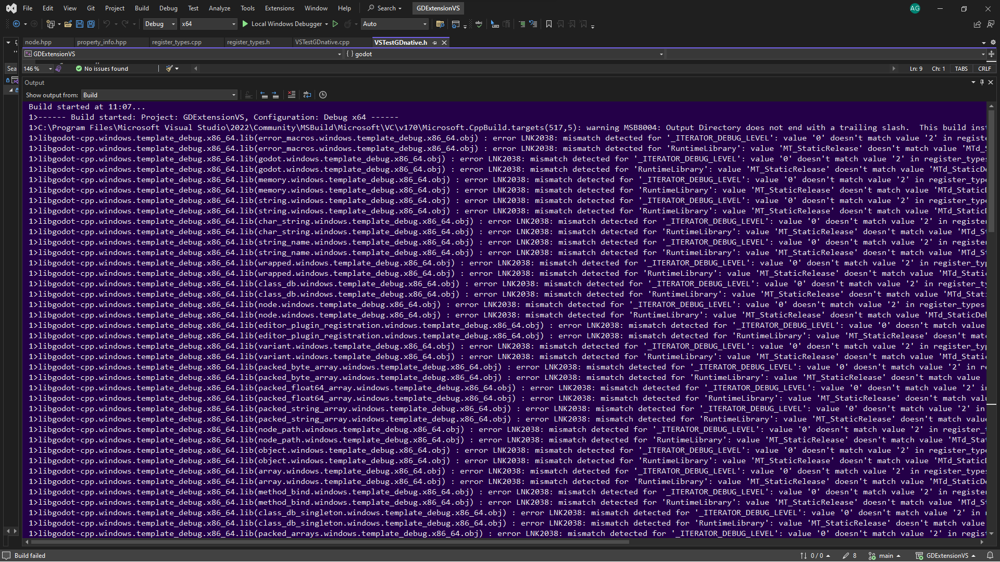

# GODOT ENGINE 4.2 GDextension BUG with Visual Studio 2022 DLL library

The project compiles, it even opens Godot Engine in debug mode, but there seems to be a problem with the bindings generated with scons, I also want to clarify that I have this project running in VScode, but there seems to be a strange bug with Visual Studio.

# Build started at 11:07...

1>------ Build started: Project: GDExtensionVS, Configuration: Debug x64 ------
1>C:\Program Files\Microsoft Visual Studio\2022\Community\MSBuild\Microsoft\VC\v170\Microsoft.CppBuild.targets(517,5): warning MSB8004: Output Directory does not end with a trailing slash.  This build instance will add the slash as it is required to allow proper evaluation of the Output Directory.
1>libgodot-cpp.windows.template_debug.x86_64.lib(error_macros.windows.template_debug.x86_64.obj) : error LNK2038: mismatch detected for '_ITERATOR_DEBUG_LEVEL': value '0' doesn't match value '2' in register_types.obj
1>libgodot-cpp.windows.template_debug.x86_64.lib(error_macros.windows.template_debug.x86_64.obj) : error LNK2038: mismatch detected for 'RuntimeLibrary': value 'MT_StaticRelease' doesn't match value 'MTd_StaticDebug' in register_types.obj
1>libgodot-cpp.windows.template_debug.x86_64.lib(godot.windows.template_debug.x86_64.obj) : error LNK2038: mismatch detected for '_ITERATOR_DEBUG_LEVEL': value '0' doesn't match value '2' in register_types.obj
1>libgodot-cpp.windows.template_debug.x86_64.lib(godot.windows.template_debug.x86_64.obj) : error LNK2038: mismatch detected for 'RuntimeLibrary': value 'MT_StaticRelease' doesn't match value 'MTd_StaticDebug' in register_types.obj
1>libgodot-cpp.windows.template_debug.x86_64.lib(memory.windows.template_debug.x86_64.obj) : error LNK2038: mismatch detected for '_ITERATOR_DEBUG_LEVEL': value '0' doesn't match value '2' in register_types.obj
1>libgodot-cpp.windows.template_debug.x86_64.lib(memory.windows.template_debug.x86_64.obj) : error LNK2038: mismatch detected for 'RuntimeLibrary': value 'MT_StaticRelease' doesn't match value 'MTd_StaticDebug' in register_types.obj
1>libgodot-cpp.windows.template_debug.x86_64.lib(string.windows.template_debug.x86_64.obj) : error LNK2038: mismatch detected for '_ITERATOR_DEBUG_LEVEL': value '0' doesn't match value '2' in register_types.obj
1>libgodot-cpp.windows.template_debug.x86_64.lib(string.windows.template_debug.x86_64.obj) : error LNK2038: mismatch detected for 'RuntimeLibrary': value 'MT_StaticRelease' doesn't match value 'MTd_StaticDebug' in register_types.obj
1>libgodot-cpp.windows.template_debug.x86_64.lib(char_string.windows.template_debug.x86_64.obj) : error LNK2038: mismatch detected for '_ITERATOR_DEBUG_LEVEL': value '0' doesn't match value '2' in register_types.obj
1>libgodot-cpp.windows.template_debug.x86_64.lib(char_string.windows.template_debug.x86_64.obj) : error LNK2038: mismatch detected for 'RuntimeLibrary': value 'MT_StaticRelease' doesn't match value 'MTd_StaticDebug' in register_types.obj
1>libgodot-cpp.windows.template_debug.x86_64.lib(string_name.windows.template_debug.x86_64.obj) : error LNK2038: mismatch detected for '_ITERATOR_DEBUG_LEVEL': value '0' doesn't match value '2' in register_types.obj
1>libgodot-cpp.windows.template_debug.x86_64.lib(string_name.windows.template_debug.x86_64.obj) : error LNK2038: mismatch detected for 'RuntimeLibrary': value 'MT_StaticRelease' doesn't match value 'MTd_StaticDebug' in register_types.obj
1>libgodot-cpp.windows.template_debug.x86_64.lib(wrapped.windows.template_debug.x86_64.obj) : error LNK2038: mismatch detected for '_ITERATOR_DEBUG_LEVEL': value '0' doesn't match value '2' in register_types.obj
1>libgodot-cpp.windows.template_debug.x86_64.lib(wrapped.windows.template_debug.x86_64.obj) : error LNK2038: mismatch detected for 'RuntimeLibrary': value 'MT_StaticRelease' doesn't match value 'MTd_StaticDebug' in register_types.obj
1>libgodot-cpp.windows.template_debug.x86_64.lib(class_db.windows.template_debug.x86_64.obj) : error LNK2038: mismatch detected for '_ITERATOR_DEBUG_LEVEL': value '0' doesn't match value '2' in register_types.obj
1>libgodot-cpp.windows.template_debug.x86_64.lib(class_db.windows.template_debug.x86_64.obj) : error LNK2038: mismatch detected for 'RuntimeLibrary': value 'MT_StaticRelease' doesn't match value 'MTd_StaticDebug' in register_types.obj
1>libgodot-cpp.windows.template_debug.x86_64.lib(node.windows.template_debug.x86_64.obj) : error LNK2038: mismatch detected for '_ITERATOR_DEBUG_LEVEL': value '0' doesn't match value '2' in register_types.obj
1>libgodot-cpp.windows.template_debug.x86_64.lib(node.windows.template_debug.x86_64.obj) : error LNK2038: mismatch detected for 'RuntimeLibrary': value 'MT_StaticRelease' doesn't match value 'MTd_StaticDebug' in register_types.obj
1>libgodot-cpp.windows.template_debug.x86_64.lib(editor_plugin_registration.windows.template_debug.x86_64.obj) : error LNK2038: mismatch detected for '_ITERATOR_DEBUG_LEVEL': value '0' doesn't match value '2' in register_types.obj
1>libgodot-cpp.windows.template_debug.x86_64.lib(editor_plugin_registration.windows.template_debug.x86_64.obj) : error LNK2038: mismatch detected for 'RuntimeLibrary': value 'MT_StaticRelease' doesn't match value 'MTd_StaticDebug' in register_types.obj
1>libgodot-cpp.windows.template_debug.x86_64.lib(variant.windows.template_debug.x86_64.obj) : error LNK2038: mismatch detected for '_ITERATOR_DEBUG_LEVEL': value '0' doesn't match value '2' in register_types.obj
1>libgodot-cpp.windows.template_debug.x86_64.lib(variant.windows.template_debug.x86_64.obj) : error LNK2038: mismatch detected for 'RuntimeLibrary': value 'MT_StaticRelease' doesn't match value 'MTd_StaticDebug' in register_types.obj
1>libgodot-cpp.windows.template_debug.x86_64.lib(packed_byte_array.windows.template_debug.x86_64.obj) : error LNK2038: mismatch detected for '_ITERATOR_DEBUG_LEVEL': value '0' doesn't match value '2' in register_types.obj
1>libgodot-cpp.windows.template_debug.x86_64.lib(packed_byte_array.windows.template_debug.x86_64.obj) : error LNK2038: mismatch detected for 'RuntimeLibrary': value 'MT_StaticRelease' doesn't match value 'MTd_StaticDebug' in register_types.obj
1>libgodot-cpp.windows.template_debug.x86_64.lib(packed_float64_array.windows.template_debug.x86_64.obj) : error LNK2038: mismatch detected for '_ITERATOR_DEBUG_LEVEL': value '0' doesn't match value '2' in register_types.obj
1>libgodot-cpp.windows.template_debug.x86_64.lib(packed_float64_array.windows.template_debug.x86_64.obj) : error LNK2038: mismatch detected for 'RuntimeLibrary': value 'MT_StaticRelease' doesn't match value 'MTd_StaticDebug' in register_types.obj
1>libgodot-cpp.windows.template_debug.x86_64.lib(packed_string_array.windows.template_debug.x86_64.obj) : error LNK2038: mismatch detected for '_ITERATOR_DEBUG_LEVEL': value '0' doesn't match value '2' in register_types.obj
1>libgodot-cpp.windows.template_debug.x86_64.lib(packed_string_array.windows.template_debug.x86_64.obj) : error LNK2038: mismatch detected for 'RuntimeLibrary': value 'MT_StaticRelease' doesn't match value 'MTd_StaticDebug' in register_types.obj
1>libgodot-cpp.windows.template_debug.x86_64.lib(node_path.windows.template_debug.x86_64.obj) : error LNK2038: mismatch detected for '_ITERATOR_DEBUG_LEVEL': value '0' doesn't match value '2' in register_types.obj
1>libgodot-cpp.windows.template_debug.x86_64.lib(node_path.windows.template_debug.x86_64.obj) : error LNK2038: mismatch detected for 'RuntimeLibrary': value 'MT_StaticRelease' doesn't match value 'MTd_StaticDebug' in register_types.obj
1>libgodot-cpp.windows.template_debug.x86_64.lib(object.windows.template_debug.x86_64.obj) : error LNK2038: mismatch detected for '_ITERATOR_DEBUG_LEVEL': value '0' doesn't match value '2' in register_types.obj
1>libgodot-cpp.windows.template_debug.x86_64.lib(object.windows.template_debug.x86_64.obj) : error LNK2038: mismatch detected for 'RuntimeLibrary': value 'MT_StaticRelease' doesn't match value 'MTd_StaticDebug' in register_types.obj
1>libgodot-cpp.windows.template_debug.x86_64.lib(array.windows.template_debug.x86_64.obj) : error LNK2038: mismatch detected for '_ITERATOR_DEBUG_LEVEL': value '0' doesn't match value '2' in register_types.obj
1>libgodot-cpp.windows.template_debug.x86_64.lib(array.windows.template_debug.x86_64.obj) : error LNK2038: mismatch detected for 'RuntimeLibrary': value 'MT_StaticRelease' doesn't match value 'MTd_StaticDebug' in register_types.obj
1>libgodot-cpp.windows.template_debug.x86_64.lib(method_bind.windows.template_debug.x86_64.obj) : error LNK2038: mismatch detected for '_ITERATOR_DEBUG_LEVEL': value '0' doesn't match value '2' in register_types.obj
1>libgodot-cpp.windows.template_debug.x86_64.lib(method_bind.windows.template_debug.x86_64.obj) : error LNK2038: mismatch detected for 'RuntimeLibrary': value 'MT_StaticRelease' doesn't match value 'MTd_StaticDebug' in register_types.obj
1>libgodot-cpp.windows.template_debug.x86_64.lib(class_db_singleton.windows.template_debug.x86_64.obj) : error LNK2038: mismatch detected for '_ITERATOR_DEBUG_LEVEL': value '0' doesn't match value '2' in register_types.obj
1>libgodot-cpp.windows.template_debug.x86_64.lib(class_db_singleton.windows.template_debug.x86_64.obj) : error LNK2038: mismatch detected for 'RuntimeLibrary': value 'MT_StaticRelease' doesn't match value 'MTd_StaticDebug' in register_types.obj
1>libgodot-cpp.windows.template_debug.x86_64.lib(packed_arrays.windows.template_debug.x86_64.obj) : error LNK2038: mismatch detected for '_ITERATOR_DEBUG_LEVEL': value '0' doesn't match value '2' in register_types.obj
1>libgodot-cpp.windows.template_debug.x86_64.lib(packed_arrays.windows.template_debug.x86_64.obj) : error LNK2038: mismatch detected for 'RuntimeLibrary': value 'MT_StaticRelease' doesn't match value 'MTd_StaticDebug' in register_types.obj
1>libgodot-cpp.windows.template_debug.x86_64.lib(object.windows.template_debug.x86_64.obj) : error LNK2038: mismatch detected for '_ITERATOR_DEBUG_LEVEL': value '0' doesn't match value '2' in register_types.obj
1>libgodot-cpp.windows.template_debug.x86_64.lib(object.windows.template_debug.x86_64.obj) : error LNK2038: mismatch detected for 'RuntimeLibrary': value 'MT_StaticRelease' doesn't match value 'MTd_StaticDebug' in register_types.obj
1>libgodot-cpp.windows.template_debug.x86_64.lib(ref_counted.windows.template_debug.x86_64.obj) : error LNK2038: mismatch detected for '_ITERATOR_DEBUG_LEVEL': value '0' doesn't match value '2' in register_types.obj
1>libgodot-cpp.windows.template_debug.x86_64.lib(ref_counted.windows.template_debug.x86_64.obj) : error LNK2038: mismatch detected for 'RuntimeLibrary': value 'MT_StaticRelease' doesn't match value 'MTd_StaticDebug' in register_types.obj
1>libgodot-cpp.windows.template_debug.x86_64.lib(resource.windows.template_debug.x86_64.obj) : error LNK2038: mismatch detected for '_ITERATOR_DEBUG_LEVEL': value '0' doesn't match value '2' in register_types.obj
1>libgodot-cpp.windows.template_debug.x86_64.lib(resource.windows.template_debug.x86_64.obj) : error LNK2038: mismatch detected for 'RuntimeLibrary': value 'MT_StaticRelease' doesn't match value 'MTd_StaticDebug' in register_types.obj
1>libgodot-cpp.windows.template_debug.x86_64.lib(main_loop.windows.template_debug.x86_64.obj) : error LNK2038: mismatch detected for '_ITERATOR_DEBUG_LEVEL': value '0' doesn't match value '2' in register_types.obj
1>libgodot-cpp.windows.template_debug.x86_64.lib(main_loop.windows.template_debug.x86_64.obj) : error LNK2038: mismatch detected for 'RuntimeLibrary': value 'MT_StaticRelease' doesn't match value 'MTd_StaticDebug' in register_types.obj
1>libgodot-cpp.windows.template_debug.x86_64.lib(window.windows.template_debug.x86_64.obj) : error LNK2038: mismatch detected for '_ITERATOR_DEBUG_LEVEL': value '0' doesn't match value '2' in register_types.obj
1>libgodot-cpp.windows.template_debug.x86_64.lib(window.windows.template_debug.x86_64.obj) : error LNK2038: mismatch detected for 'RuntimeLibrary': value 'MT_StaticRelease' doesn't match value 'MTd_StaticDebug' in register_types.obj
1>libgodot-cpp.windows.template_debug.x86_64.lib(packed_vector2_array.windows.template_debug.x86_64.obj) : error LNK2038: mismatch detected for '_ITERATOR_DEBUG_LEVEL': value '0' doesn't match value '2' in register_types.obj
1>libgodot-cpp.windows.template_debug.x86_64.lib(packed_vector2_array.windows.template_debug.x86_64.obj) : error LNK2038: mismatch detected for 'RuntimeLibrary': value 'MT_StaticRelease' doesn't match value 'MTd_StaticDebug' in register_types.obj
1>libgodot-cpp.windows.template_debug.x86_64.lib(packed_vector3_array.windows.template_debug.x86_64.obj) : error LNK2038: mismatch detected for '_ITERATOR_DEBUG_LEVEL': value '0' doesn't match value '2' in register_types.obj
1>libgodot-cpp.windows.template_debug.x86_64.lib(packed_vector3_array.windows.template_debug.x86_64.obj) : error LNK2038: mismatch detected for 'RuntimeLibrary': value 'MT_StaticRelease' doesn't match value 'MTd_StaticDebug' in register_types.obj
1>libgodot-cpp.windows.template_debug.x86_64.lib(projection.windows.template_debug.x86_64.obj) : error LNK2038: mismatch detected for '_ITERATOR_DEBUG_LEVEL': value '0' doesn't match value '2' in register_types.obj
1>libgodot-cpp.windows.template_debug.x86_64.lib(projection.windows.template_debug.x86_64.obj) : error LNK2038: mismatch detected for 'RuntimeLibrary': value 'MT_StaticRelease' doesn't match value 'MTd_StaticDebug' in register_types.obj
1>libgodot-cpp.windows.template_debug.x86_64.lib(rid.windows.template_debug.x86_64.obj) : error LNK2038: mismatch detected for '_ITERATOR_DEBUG_LEVEL': value '0' doesn't match value '2' in register_types.obj
1>libgodot-cpp.windows.template_debug.x86_64.lib(rid.windows.template_debug.x86_64.obj) : error LNK2038: mismatch detected for 'RuntimeLibrary': value 'MT_StaticRelease' doesn't match value 'MTd_StaticDebug' in register_types.obj
1>libgodot-cpp.windows.template_debug.x86_64.lib(callable.windows.template_debug.x86_64.obj) : error LNK2038: mismatch detected for '_ITERATOR_DEBUG_LEVEL': value '0' doesn't match value '2' in register_types.obj
1>libgodot-cpp.windows.template_debug.x86_64.lib(callable.windows.template_debug.x86_64.obj) : error LNK2038: mismatch detected for 'RuntimeLibrary': value 'MT_StaticRelease' doesn't match value 'MTd_StaticDebug' in register_types.obj
1>libgodot-cpp.windows.template_debug.x86_64.lib(signal.windows.template_debug.x86_64.obj) : error LNK2038: mismatch detected for '_ITERATOR_DEBUG_LEVEL': value '0' doesn't match value '2' in register_types.obj
1>libgodot-cpp.windows.template_debug.x86_64.lib(signal.windows.template_debug.x86_64.obj) : error LNK2038: mismatch detected for 'RuntimeLibrary': value 'MT_StaticRelease' doesn't match value 'MTd_StaticDebug' in register_types.obj
1>libgodot-cpp.windows.template_debug.x86_64.lib(dictionary.windows.template_debug.x86_64.obj) : error LNK2038: mismatch detected for '_ITERATOR_DEBUG_LEVEL': value '0' doesn't match value '2' in register_types.obj
1>libgodot-cpp.windows.template_debug.x86_64.lib(dictionary.windows.template_debug.x86_64.obj) : error LNK2038: mismatch detected for 'RuntimeLibrary': value 'MT_StaticRelease' doesn't match value 'MTd_StaticDebug' in register_types.obj
1>libgodot-cpp.windows.template_debug.x86_64.lib(packed_int32_array.windows.template_debug.x86_64.obj) : error LNK2038: mismatch detected for '_ITERATOR_DEBUG_LEVEL': value '0' doesn't match value '2' in register_types.obj
1>libgodot-cpp.windows.template_debug.x86_64.lib(packed_int32_array.windows.template_debug.x86_64.obj) : error LNK2038: mismatch detected for 'RuntimeLibrary': value 'MT_StaticRelease' doesn't match value 'MTd_StaticDebug' in register_types.obj
1>libgodot-cpp.windows.template_debug.x86_64.lib(packed_int64_array.windows.template_debug.x86_64.obj) : error LNK2038: mismatch detected for '_ITERATOR_DEBUG_LEVEL': value '0' doesn't match value '2' in register_types.obj
1>libgodot-cpp.windows.template_debug.x86_64.lib(packed_int64_array.windows.template_debug.x86_64.obj) : error LNK2038: mismatch detected for 'RuntimeLibrary': value 'MT_StaticRelease' doesn't match value 'MTd_StaticDebug' in register_types.obj
1>libgodot-cpp.windows.template_debug.x86_64.lib(packed_float32_array.windows.template_debug.x86_64.obj) : error LNK2038: mismatch detected for '_ITERATOR_DEBUG_LEVEL': value '0' doesn't match value '2' in register_types.obj
1>libgodot-cpp.windows.template_debug.x86_64.lib(packed_float32_array.windows.template_debug.x86_64.obj) : error LNK2038: mismatch detected for 'RuntimeLibrary': value 'MT_StaticRelease' doesn't match value 'MTd_StaticDebug' in register_types.obj
1>libgodot-cpp.windows.template_debug.x86_64.lib(packed_color_array.windows.template_debug.x86_64.obj) : error LNK2038: mismatch detected for '_ITERATOR_DEBUG_LEVEL': value '0' doesn't match value '2' in register_types.obj
1>libgodot-cpp.windows.template_debug.x86_64.lib(packed_color_array.windows.template_debug.x86_64.obj) : error LNK2038: mismatch detected for 'RuntimeLibrary': value 'MT_StaticRelease' doesn't match value 'MTd_StaticDebug' in register_types.obj
1>libgodot-cpp.windows.template_debug.x86_64.lib(style_box.windows.template_debug.x86_64.obj) : error LNK2038: mismatch detected for '_ITERATOR_DEBUG_LEVEL': value '0' doesn't match value '2' in register_types.obj
1>libgodot-cpp.windows.template_debug.x86_64.lib(style_box.windows.template_debug.x86_64.obj) : error LNK2038: mismatch detected for 'RuntimeLibrary': value 'MT_StaticRelease' doesn't match value 'MTd_StaticDebug' in register_types.obj
1>libgodot-cpp.windows.template_debug.x86_64.lib(texture2d.windows.template_debug.x86_64.obj) : error LNK2038: mismatch detected for '_ITERATOR_DEBUG_LEVEL': value '0' doesn't match value '2' in register_types.obj
1>libgodot-cpp.windows.template_debug.x86_64.lib(texture2d.windows.template_debug.x86_64.obj) : error LNK2038: mismatch detected for 'RuntimeLibrary': value 'MT_StaticRelease' doesn't match value 'MTd_StaticDebug' in register_types.obj
1>libgodot-cpp.windows.template_debug.x86_64.lib(plane.windows.template_debug.x86_64.obj) : error LNK2038: mismatch detected for '_ITERATOR_DEBUG_LEVEL': value '0' doesn't match value '2' in register_types.obj
1>libgodot-cpp.windows.template_debug.x86_64.lib(plane.windows.template_debug.x86_64.obj) : error LNK2038: mismatch detected for 'RuntimeLibrary': value 'MT_StaticRelease' doesn't match value 'MTd_StaticDebug' in register_types.obj
1>libgodot-cpp.windows.template_debug.x86_64.lib(basis.windows.template_debug.x86_64.obj) : error LNK2038: mismatch detected for '_ITERATOR_DEBUG_LEVEL': value '0' doesn't match value '2' in register_types.obj
1>libgodot-cpp.windows.template_debug.x86_64.lib(basis.windows.template_debug.x86_64.obj) : error LNK2038: mismatch detected for 'RuntimeLibrary': value 'MT_StaticRelease' doesn't match value 'MTd_StaticDebug' in register_types.obj
1>libgodot-cpp.windows.template_debug.x86_64.lib(canvas_item.windows.template_debug.x86_64.obj) : error LNK2038: mismatch detected for '_ITERATOR_DEBUG_LEVEL': value '0' doesn't match value '2' in register_types.obj
1>libgodot-cpp.windows.template_debug.x86_64.lib(canvas_item.windows.template_debug.x86_64.obj) : error LNK2038: mismatch detected for 'RuntimeLibrary': value 'MT_StaticRelease' doesn't match value 'MTd_StaticDebug' in register_types.obj
1>libgodot-cpp.windows.template_debug.x86_64.lib(vector3.windows.template_debug.x86_64.obj) : error LNK2038: mismatch detected for '_ITERATOR_DEBUG_LEVEL': value '0' doesn't match value '2' in register_types.obj
1>libgodot-cpp.windows.template_debug.x86_64.lib(vector3.windows.template_debug.x86_64.obj) : error LNK2038: mismatch detected for 'RuntimeLibrary': value 'MT_StaticRelease' doesn't match value 'MTd_StaticDebug' in register_types.obj
1>libgodot-cpp.windows.template_debug.x86_64.lib(quaternion.windows.template_debug.x86_64.obj) : error LNK2038: mismatch detected for '_ITERATOR_DEBUG_LEVEL': value '0' doesn't match value '2' in register_types.obj
1>libgodot-cpp.windows.template_debug.x86_64.lib(quaternion.windows.template_debug.x86_64.obj) : error LNK2038: mismatch detected for 'RuntimeLibrary': value 'MT_StaticRelease' doesn't match value 'MTd_StaticDebug' in register_types.obj
1>libgodot-cpp.windows.template_debug.x86_64.lib(material.windows.template_debug.x86_64.obj) : error LNK2038: mismatch detected for '_ITERATOR_DEBUG_LEVEL': value '0' doesn't match value '2' in register_types.obj
1>libgodot-cpp.windows.template_debug.x86_64.lib(material.windows.template_debug.x86_64.obj) : error LNK2038: mismatch detected for 'RuntimeLibrary': value 'MT_StaticRelease' doesn't match value 'MTd_StaticDebug' in register_types.obj
1>libgodot-cpp.windows.template_debug.x86_64.lib(mesh.windows.template_debug.x86_64.obj) : error LNK2038: mismatch detected for '_ITERATOR_DEBUG_LEVEL': value '0' doesn't match value '2' in register_types.obj
1>libgodot-cpp.windows.template_debug.x86_64.lib(mesh.windows.template_debug.x86_64.obj) : error LNK2038: mismatch detected for 'RuntimeLibrary': value 'MT_StaticRelease' doesn't match value 'MTd_StaticDebug' in register_types.obj
1>   Creating library .\Godot_proyect\bin\GDExtensionVS.lib and object .\Godot_proyect\bin\GDExtensionVS.exp
1>register_types.obj : error LNK2019: unresolved external symbol _CrtDbgReport referenced in function "void * __cdecl std::_Allocate_manually_vector_aligned<struct std::_Default_allocate_traits>(unsigned __int64)" (??$_Allocate_manually_vector_aligned@U_Default_allocate_traits@std@@@std@@YAPEAX_K@Z)
1>.\Godot_proyect\bin\GDExtensionVS.dll : fatal error LNK1120: 1 unresolved externals
1>Done building project "GDExtensionVS.vcxproj" -- FAILED.
========== Build: 0 succeeded, 1 failed, 0 up-to-date, 0 skipped ==========
========== Build completed at 11:07 and took 02,300 seconds ==========

# I leave links to two preconfigured Vscode projects working correctly.
https://gitlab.com/kone9/godot-engine-4.2-template-gdextension-with-vscode-windows-11
https://gitlab.com/kone9/godot-engine-4.2-template-gdextension-with-vscode

